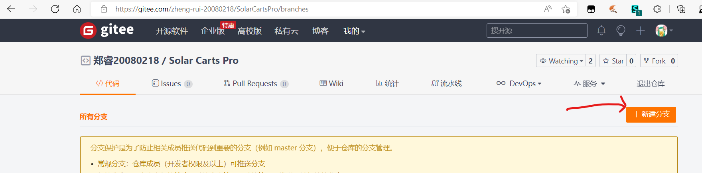

# Git教程

## 第一部分：安装
1. 编辑器一定修改成Notepad
   
2. 其余内容默认
   
3. 安装好后桌面会出现git bash

## 第二部分：基本操作
1. 选定一个全英文名称文件夹
   
2. 创建一个工作区（新文件夹，必须要是英文名）
   
3. 打开git bash, 切换到目录
    * 使用 **cd [路径]** 的命令 
    * 所有的 \ 要变成 \\\\
    * 复制粘贴请使用鼠标右键，__不要使用ctrl+v__
    * 在打开目录下右键 Git Bash Here 也可以
  
4. 创建仓库  -git init_  即可
   
5. 在工作区文件夹编辑好文件，提交到暂存区
    *  __git add [文件名，纯英文，带扩展名]__
    *  __git add .提交全部__
  
6. 把暂存区提交到版本库
    *  __git commit__
    *  __必须写注释__
    *  __如果安装的时候选择的Notepad，那么直接用可视化的方式更改__
    *  __否则使用 git commit -m [注释]进行更改__

## 第三部分：分支与远程操作
1. 在分支管理页面创建自己的分支(**必须使用自己的名字命名**)
   

2. 使用 **git clone [URL]** 克隆仓库
    * 建议使用HTTPS链接下载
    * 克隆下来的是**默认分支**(master)

3. 使用 **git branch -a** 查看所有分支(带 * 号的是当前分支)

4. 使用 **git switch [target]** 切换分支
    * 文件夹内文件会发生变化，不用担心
    * 可能需要 **git checkout origin/[target]** 来连接远程分支
  
5.修改文件后的提交方法：

   1. 使用**git add .**将修改过的所有文件提交到**暂存区**
   2. 使用**git commit -m [message]**将暂存区里的文件提交到本地仓库
        * __请按规定填写提交信息__
        * 现在文件还没有提交到Gitee，**这是最后的修改机会**
   3. 使用**git push origin [branch]**将本地仓库同步到Gitee上
        * __现在文件已经提交完成__，如果有问题请找郑睿撤销操作